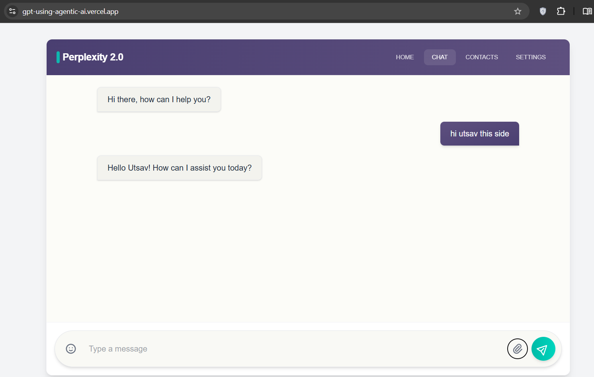

<h1 align="center">
🤖 GPT using Agentic AI
</h1>

<p align="center">
An intelligent AI assistant powered by <b>LangGraph</b>, <b>FastAPI</b>, <b>Next.js</b>, and <b>OpenAI GPT-4o</b>, featuring real-time response streaming, web search integration, conversation memory, and Human-in-the-Loop approval for controlled tool execution.
</p>

<p align="center">


</p>

---

## 📖 Overview

GPT using Agentic AI is a full-stack AI chatbot that demonstrates how modern **Agentic AI systems** can be built using **LangGraph**, **FastAPI**, and **Next.js**.

Unlike traditional chatbots that simply generate responses, this application enables the language model to reason about a user's request, determine when external tools are required, perform web searches, maintain conversational context, and stream responses back to the user in real time.

The project follows a modular client-server architecture where the frontend provides a clean and responsive chat interface while the backend manages agent execution, tool orchestration, memory management, and streaming responses.

It serves as a practical example of integrating Large Language Models with external tools while maintaining user control through a Human-in-the-Loop (HITL) workflow.

---

## 🌐 Live Demo

**Try the application here**

> http://gpt-using-agentic-ai.vercel.app/

---

## 📸 Application Preview

### Chat Interface

> Replace the image below with your latest project screenshot.

<p align="center">

</p>

---

## ✨ Features

### 🤖 Intelligent AI Assistant

- Natural conversational interface powered by GPT-4o.
- Context-aware conversations with persistent memory.
- Intelligent response generation for general and technical queries.

---

### 🔍 Integrated Web Search

The AI can automatically decide when external information is required.

Using Tavily Search, the assistant can:

- Search the internet
- Read relevant information
- Summarize findings
- Generate accurate responses using fresh data

---

### 🧠 Conversation Memory

The application maintains conversation state throughout the session using LangGraph Memory.

This enables:

- Context-aware replies
- Multi-turn conversations
- Better follow-up question handling

---

### ⚡ Real-Time Streaming

Instead of waiting for an entire response to finish generating, answers are streamed token-by-token using Server-Sent Events (SSE).

Benefits include:

- Lower perceived latency
- Better user experience
- Interactive response generation

---

### 👨‍💻 Human-in-the-Loop (HITL)

Before executing external tools, the application supports Human-in-the-Loop approval.

This provides:

- Better transparency
- User control
- Safer tool execution
- Reduced unnecessary API calls

---

### 🏗 Modern Architecture

The project follows a scalable architecture by separating:

- Frontend
- Backend
- Agent workflow
- Tool execution
- Memory management

This makes the application easier to maintain and extend.

---

## 🚀 Tech Stack

| Category | Technologies |
|----------|--------------|
| Frontend | Next.js, React, TypeScript |
| Backend | FastAPI, Python |
| AI Framework | LangGraph |
| LLM | OpenAI GPT-4o |
| Search Tool | Tavily Search API |
| Streaming | Server-Sent Events (SSE) |
| Styling | CSS |
| Deployment | Vercel |

---

# 🏗️ System Architecture

The application follows a modular client-server architecture where each component is responsible for a specific task. The frontend handles user interaction, the backend manages API requests, LangGraph orchestrates the AI workflow, and external services provide language intelligence and web search capabilities.

```text
                         ┌────────────────────────┐
                         │        User            │
                         └────────────┬───────────┘
                                      │
                                      ▼
                      ┌────────────────────────────────┐
                      │   Next.js + React Frontend     │
                      │  Chat UI • Streaming • HITL    │
                      └────────────┬───────────────────┘
                                   │
                                   ▼
                    ┌──────────────────────────────────┐
                    │        FastAPI Backend           │
                    │ REST APIs • SSE Streaming        │
                    └────────────┬─────────────────────┘
                                 │
                                 ▼
                    ┌──────────────────────────────────┐
                    │      LangGraph Agent             │
                    │ Reasoning • Memory • Workflow    │
                    └────────────┬─────────────────────┘
                                 │
                 ┌───────────────┴────────────────┐
                 ▼                                ▼
        OpenAI GPT-4o                  Tavily Search API
                 │                                │
                 └───────────────┬────────────────┘
                                 ▼
                   Human-in-the-Loop Approval
                                 │
                                 ▼
                   Stream Response back to Client
```

---

# ⚙️ How It Works

The workflow is designed around an agentic decision-making process rather than a simple request-response interaction.

### Step 1 — User Input

The user submits a question through the chat interface.

---

### Step 2 — Backend Processing

The frontend sends the request to the FastAPI backend, which forwards it to the LangGraph workflow.

---

### Step 3 — Agent Reasoning

The LangGraph agent analyzes the prompt and decides whether it has enough information to answer directly or needs to use external tools.

---

### Step 4 — Human Approval (HITL)

If a tool call is required, the user is asked for approval before the request is executed.

This ensures transparency and gives users full control over external tool usage.

---

### Step 5 — Tool Execution

After approval, the appropriate tool is executed.

Current supported tool:

- Tavily Search

The search results are returned to the language model for further reasoning.

---

### Step 6 — AI Response Generation

The model combines:

- Conversation history
- Search results (if any)
- User prompt

to generate a contextual response.

---

### Step 7 — Streaming Output

Instead of waiting for the entire response, the backend streams tokens using Server-Sent Events (SSE), allowing users to read the answer as it is generated.

---

# 📂 Project Structure

```text
GPT-using-AgenticAI
│
├── client/                 # Next.js frontend
│   ├── app/
│   ├── components/
│   ├── public/
│   └── ...
│
├── server/                 # FastAPI backend
│   ├── app/
│   ├── graph/
│   ├── routes/
│   ├── tools/
│   └── ...
│
├── README.md
├── LICENSE
└── ...
```

---

# 🛠 Installation

## 1. Clone the Repository

```bash
git clone :- https://github.com/Utsav07-hub/GPT-using-Agentic-AI.git

cd GPT-using-AgenticAI
```

---

# 💬 Usage

Once both the frontend and backend are running, open the application in your browser and start interacting with the AI assistant.

The application supports both general conversations and real-time web-assisted responses.

### Example Prompts

```text
Explain how LangGraph works.

Latest AI news today.

Compare FastAPI and Flask.

Summarize the advantages of Server-Sent Events.

What are the latest features of GPT-4o?
```

When additional information is required, the agent can automatically perform a web search (with user approval) before generating a response.

---

# 🔄 Agent Workflow

The application follows an agent-based execution flow rather than a traditional request-response pipeline.

```text
User Query
     │
     ▼
Frontend (Next.js)
     │
     ▼
FastAPI Backend
     │
     ▼
LangGraph Agent
     │
     ├───────────────┐
     │               │
     ▼               ▼
Direct Answer     Tool Required?
                     │
             ┌───────┴────────┐
             │                │
             ▼                ▼
          No Tool      Human Approval
                              │
                              ▼
                      Tavily Search API
                              │
                              ▼
                      Search Results
                              │
                              ▼
                    GPT-4o Generates Answer
                              │
                              ▼
                 Stream Response via SSE
                              │
                              ▼
                          Frontend UI
```

---

# 📦 Key Technologies

| Technology | Purpose |
|------------|---------|
| **Next.js** | Frontend framework |
| **React** | Interactive UI |
| **TypeScript** | Type safety |
| **FastAPI** | Backend API |
| **LangGraph** | Agent orchestration |
| **OpenAI GPT-4o** | Language model |
| **Tavily Search** | Web search integration |
| **Server-Sent Events (SSE)** | Real-time streaming |
| **Vercel** | Frontend deployment |

---

# 🚀 Future Improvements

Although the current implementation already supports conversational AI, web search, streaming, and Human-in-the-Loop approval, several enhancements can further improve the project.

### Planned Features

- Support multiple LLM providers (OpenAI, Gemini, Claude, Ollama)
- Chat history persistence
- Authentication and user accounts
- Dark and Light theme switching
- Markdown rendering with syntax highlighting
- File upload support (PDF, DOCX, TXT)
- Retrieval-Augmented Generation (RAG)
- Additional external tools (Weather, Calculator, Wikipedia, GitHub Search)
- Docker support for simplified deployment
- CI/CD pipeline using GitHub Actions

---

# 🤝 Contributing

Contributions, ideas, and suggestions are always welcome.

If you discover a bug or have an idea for improving the project, feel free to:

- Open an Issue
- Submit a Pull Request
- Share feedback

Please ensure that your changes are well documented and follow the existing project structure.

---

# 🙏 Acknowledgements

This project is built using several amazing open-source technologies.

Special thanks to:

- OpenAI
- LangChain
- LangGraph
- Tavily Search
- FastAPI
- Next.js
- React

Without these tools, building modern AI-powered applications would be significantly more challenging.

---

# 📄 License

This project is licensed under the **MIT License**.

See the [LICENSE](LICENSE) file for more information.

---

# ⭐ Support

If you found this project helpful, consider giving it a ⭐ on GitHub.

Your support helps the project reach more developers and motivates future improvements.

---

<p align="center">

Built with ❤️ using FastAPI, LangGraph, Next.js, and OpenAI GPT-4o.

</p>